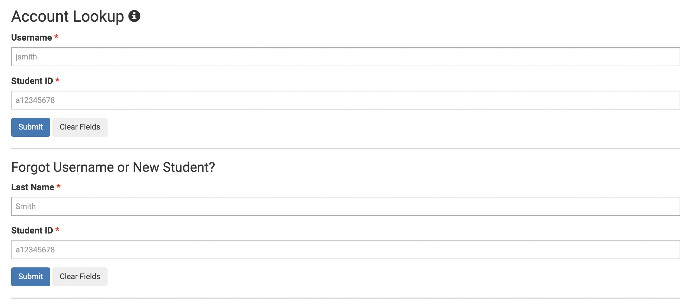
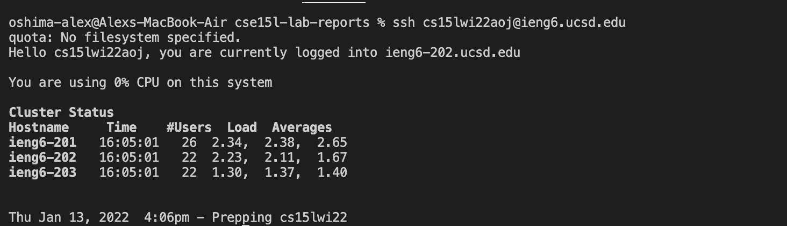
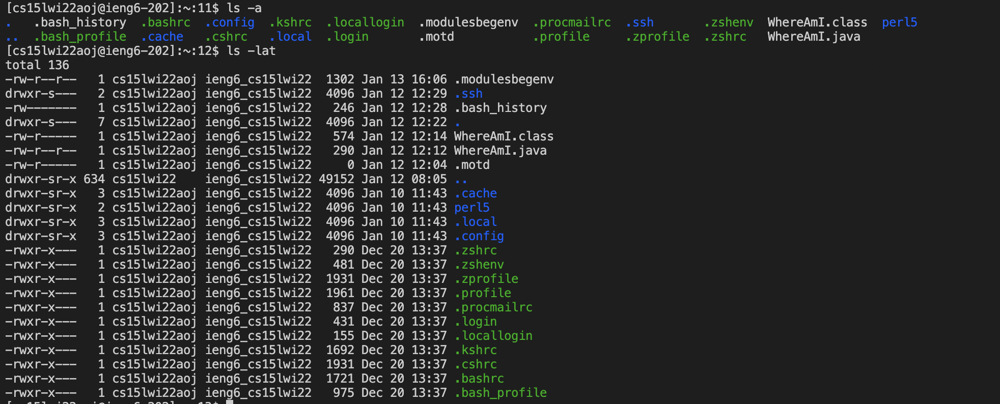
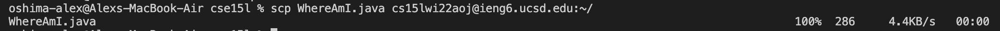

## Week One Lab Report
**Alex Oshima**  
**PID: A1695817**

## How to log into a course-specific account on ieng6

1) **Installing VScode**\
For this course we will be using VScode so lets first download it. - [VSCode Download](https://code.visualstudio.com/download)

    

2) **Remotely Connecting**\
First you will need your sources specific account login - [Find it here](https://sdacs.ucsd.edu/~icc/index.php)

    

    Next you should open up the terminal in VScode  

    Now youre going to connect to ieng6 using the following command 
    (Changing the zz to your unique account)
    >ssh cs15lwi22zz@ieng6.ucsd.edu  

    Next you'll have to enter your password 

    

3) **Run Some Commands**

    Try inputing some of the following commands into the terminal
    * cd ~
    * cd
    * ls -lat
    * ls -a

    **EX**  

    

4) **Moving Files with scp**\
    Next you'll practice transfering your files from the local machine to the remote machine
    *Remember to log out of the remote machine with crtl + d*
    Now from your local machine use the following command to send a file of your chosing
    >scp fileName.fileExtension cs15lwi22zz@ieng6.ucsd.edu:~/

    
    The ~/ sends the file to the default directory on the recieving machine

5) **Setting an SSH Key**

6) **Optimizing Remote Running**