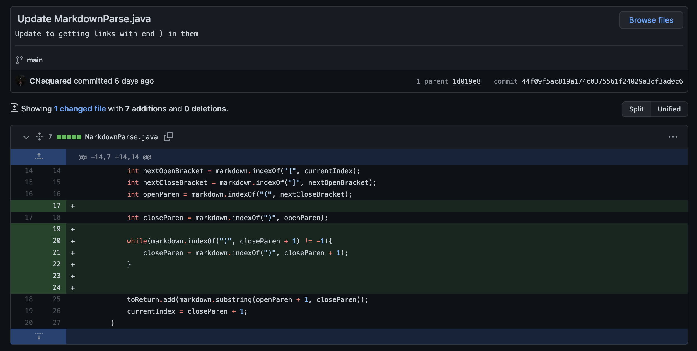
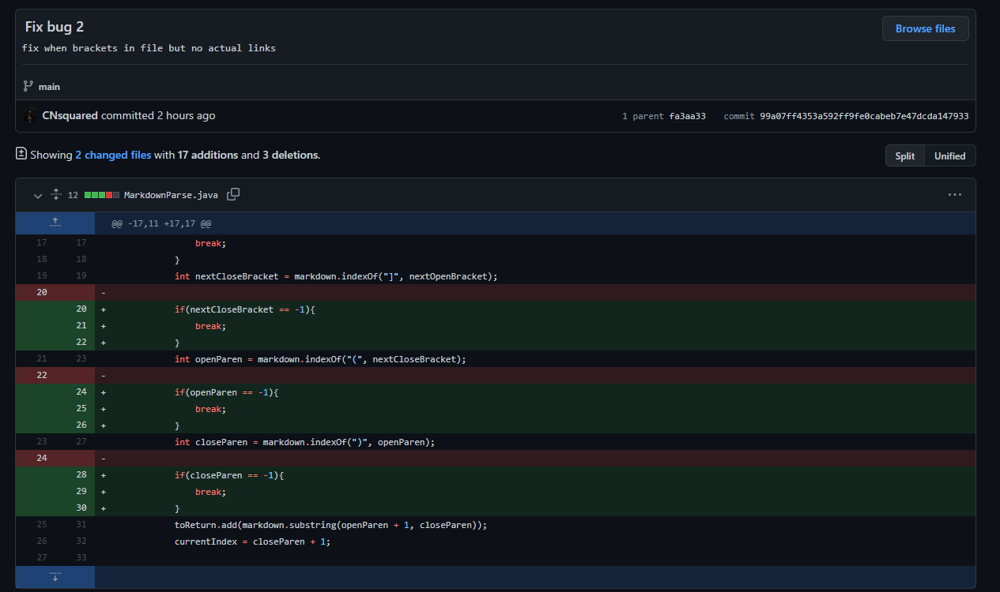
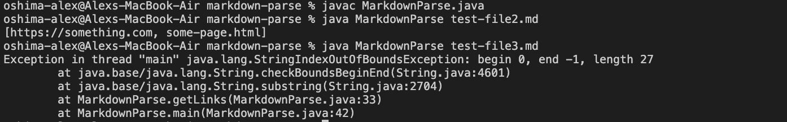
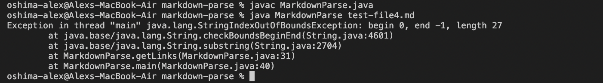

# Week Four Lab Report
**Alex Oshima**  
**PID: A1695817**

## Change 1

### Change Implemented

### Failure-inducing input
[Test File 2](Files/test-file2.md)

### Symptom

### Explanation
The bug was that when there was text following a set of links the program would enter an infinite loop. Since there was more text following the links the loop would continue because the current index would be less than the length of all the tetx in the file. The program would then look for the next open bracket and find none. So next openBracket would be set to -1. Because of that when the program then looked for the next closing bracket it would do it from -1 and pick up the closing bracket of the very first link and continue this cycle. This caused the symptom of the program eventually crashing because it ran out of Memory. To fix this I implemented an if statement that if there was not another open bracket the loop would be terminated. 

## Change 2

### Change Implemented

### Failure-inducing input
[Test File 3](Files/test-file3.md)

### Symptom

### Explanation
The bug was that when there was brackets in a file and then next following the brackets on another line then the program would look for open and close parenethesis and find none. This would make openParen and closeParen equal to -1 and when the program tried to substring between the open and close parenthesis it would have the symptomn of an index out of bound error. To fix this I added an if statement that if no open parenthesis is found than the while loop is broken.

## Change 3

### Change Implemented

### Failure-inducing input
[Test File 4](Files/test-file4.md)

### Symptom

### Explanation
This bug was very similar to the bug found in change 2 and was actually solved by the same change. The bug was that when there was brackets in a file and text following the brackets but no actual links then the program would look for open and close parenethesis an find none. This would make openParen and closeParen equal to -1 and when the program tried to substring between the open and close parenthesis it would have the symptomn of an index out of bound error. To fix this I added an if statement that if no open parenthesis is found than the while loop is broken.