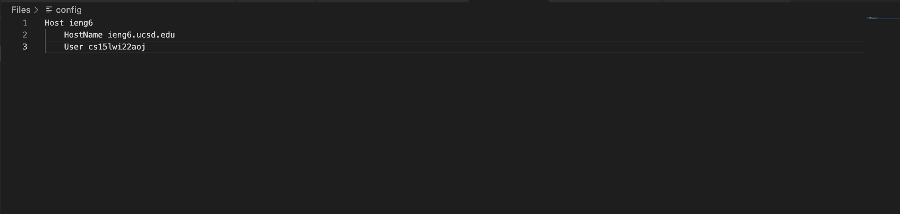

# Week Six Lab Report
**Alex Oshima**  
**PID: A1695817**

## Streamlining ssh Configuration

This allows easier access to the servers by using a nickname for the severs instead of writing out the entire name of the server each time

### .ssh/config

I used vs code to write out the necessary code then transferred it into the .ssh directory on my local machine

### ssh command 

I was succesfully able to login into the ieng6 servers by using the host name

### scp command 

I was also able to successfully scp a file into ieng6 using its host name