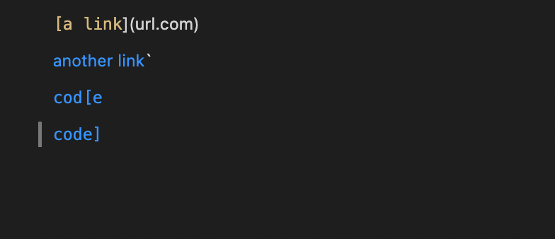
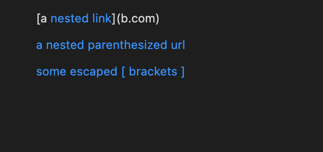
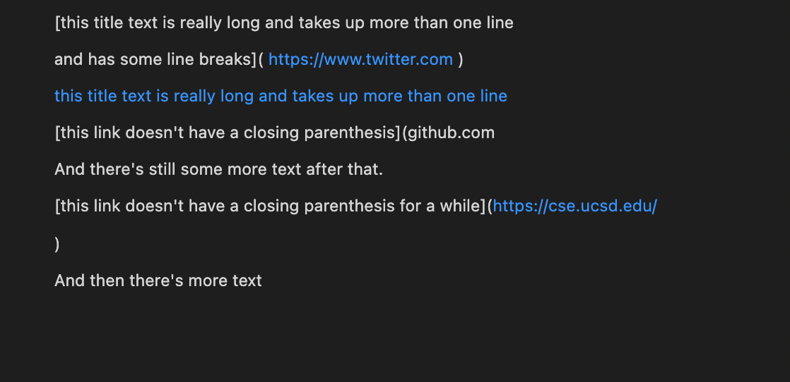
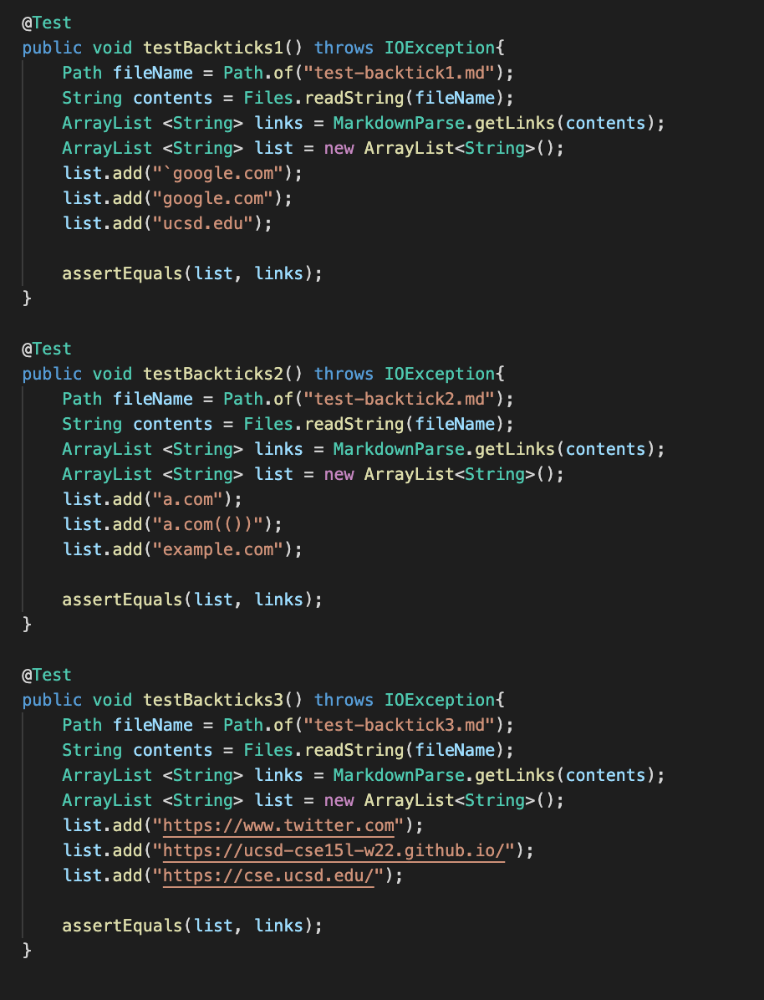
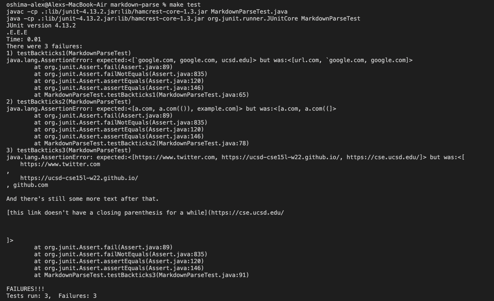
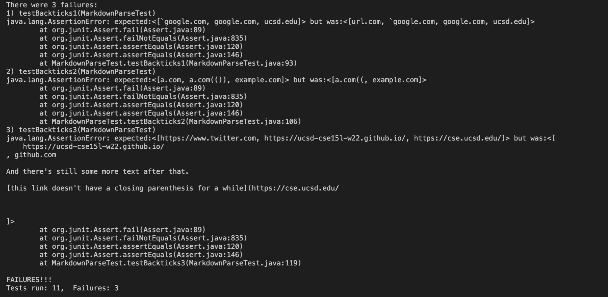

# Week Eight Lab Report
**Alex Oshima**  
**PID: A1695817**

## Testing 3 Markdown snippets

Adding three test cases to both my own implementation of Markdown parse and the one being reviewed

### Markdown Repositories 

#### My Own
[Markdown Parse Repository](https://github.com/CNsquared/markdown-parse)

#### Reviewed Implementation
[Markdown Parse Repository being Reviewed](https://github.com/littlefishy1/markdown-parse)

### Expected output
Using VSCode's preview function determined the expected output for each of the Markdown snippets

### Creating JUnit Tests

JUnit tests on each of the markdown snippets 

### Output 

#### My Implementation

**All tests failed**

#### Reviewed Implementation

**All tests failed**

### Questions

*Do you think there is a small (<10 lines) code change that will make your program work for snippet 1 and all related cases that use inline code with backticks? If yes, describe the code change. If not, describe why it would be a more involved change.* 

One potential change that could be implemented is a backtick finder helper method that checks to see if the essential starting charcters, open bracket or open parenthesis, are in between backticks. If they are then not counting them 

*Do you think there is a small (<10 lines) code change that will make your program work for snippet 2 and all related cases that nest parentheses, brackets, and escaped brackets? If yes, describe the code change. If not, describe why it would be a more involved change.*

This would be a more involved change because you have to account for sets of bracktes and parentheses that are insides other sets of brackets and parentheses as well as unpaired parentheses and brackets. 

*Do you think there is a small (<10 lines) code change that will make your program work for snippet 3 and all related cases that have newlines in brackets and parentheses? If yes, describe the code change. If not, describe why it would be a more involved change.*

One potential fix would be to remove the empty space before a link as well as looking at the back of a potential link and not including it if there is a new line in it